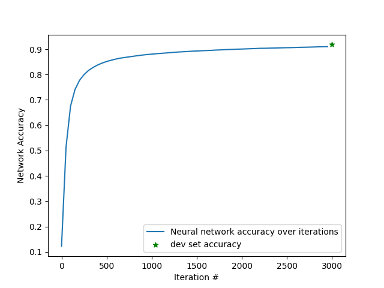

# Neural Network From Scratch

## Overview
This project served as my introduction into machine learning with a simple 2-layer neural network with NumPy and pandas, utilizing forward and back propagation and gradient descent. Using the classic MNIST dataset the network obtained consistent ~92% accuracy over multiple trials on randomized dev data it was not trained on.



## How to run
```
pip install numpy pandas matplotlib
python3 main.py
```
place train.csv (I used the public MNIST set from Kaggle) in data/

## Project Structure
784 (input pixels) → 10 (ReLU) → 10 (softmax output, digits 0-9)
For more details on the math behind this network, see Samson Zhang's "Building a neural network FROM SCRATCH (no Tensorflow/Pytorch, just numpy & math)"

## What I debugged
- A gradient bug where dW1 was computed from the wrong layer's error
  (used dZ2 instead of the correctly backpropagated dZ1), which affected accuracy scores
- Pixel values needed normalizing to [0, 1]